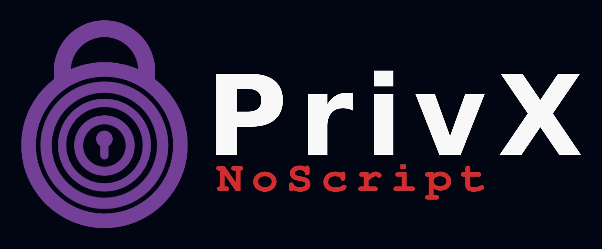

# 🕵🏻 PrivX

**PrivX** is a secure, private pastebin alternative without JavaScript. Forked from https://github.com/IncognitoBin/IncognitoBin

## ⚡ Features

- 🧅 **No-Script**: Completely javascript-free. Works perfectly with the most strict Tor browser settings!
- 💎 **Hardened Docker**: Zero-Trust docker network.
- 🔑 **Improved Key**: Secure IV key insertion.

- 🛡️ **End-to-End Encryption with AES-256:** Data is encrypted client-side using AES-256, a robust encryption standard, ensuring that only the user can access their information. The server remains unaware of the data's content (zero-server knowledge).
- 🔐 **Zero-Knowledge Architecture**: Since all data is encrypted on the client side, **even PrivX administrators or the project owner cannot view stored data**.
- 🖍️ **Syntax Highlighting**: PrivX supports syntax highlighting for most programming languages, making code snippets easy to read and visually appealing.
- 🎭 **Anonymous Account System**: Users are assigned a unique account number upon sign-up, which they use for logging in, maintaining full anonymity and avoiding the need for personal information.
- 🔍 **Private Search**: Search through your own pastes without compromising privacy.
- ⏳ **Automatic Paste Expiry**: Set custom expiration times for your pastes, after which they are permanently deleted from the system.
- 💥 **Burn after read**: The paste is permanently deleted after one view.
- 🔓 **Open Source**: As an open-source project, PrivX encourages transparency and community involvement in development.

  
## 🌐 Try It Online

To experience PrivX without a local installation, visit [PrivX.Li](https://privx.li/).
Available on Tor [Onion](http://5ubt5q7iirvcgrdeykiul77lvu5gnw3fsdhrh2jhrdn2kq35l4qoetyd.onion/).

## 🛠️ Quick Setup

### Prerequisites
- Docker
- Docker Compose

### Installation Steps

```bash
git clone https://github.com/TorDotWatch/privx
```
```bash
cd privx
```

After running this command, open `.env` file and update it's values as per your needs:
```bash
cp env.template .env
```

Start
```bash
docker compose up -d
```
Wait approximately 40 seconds for the services to initialize.

Access PrivX:
Open your browser and navigate to `http://localhost:8181`


## Development
Checkout Dockerfile and docker-compose file for live code reloading

## 📜 License

This project is licensed under the MIT License. See the [LICENSE](LICENSE) file for details.
